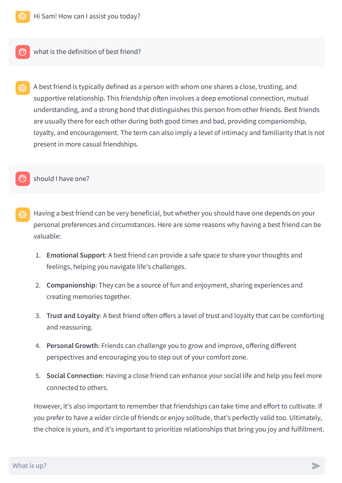

# Chat-Bot with memory
This repo is a simple chat bot using Langgraph and Streamlit libraries. It uses OpenAI LLM models using Langchain ChatOpenAI. It can be adapted to other chat models as well.

### 1. Environment variables setup 
- OPENAI_API_KEY:  ## api key obtained from OpenAI
### 2. Setting up Python Environment
- Below is instructions to setup a new Python environment using Conda. In a Conda prompt, create a new environment and activate.
```yaml
$ conda create -n chatbot python=3.12
$ conda activate chatbot
```
- Install all dependencies.
```yaml
$ pip install requirements.txt
```
### 3. Running the Chat-Bot
- After running the command below, you can start chatting,
```yaml
$ streamlit run streamlit_app.py
```
- as below:
